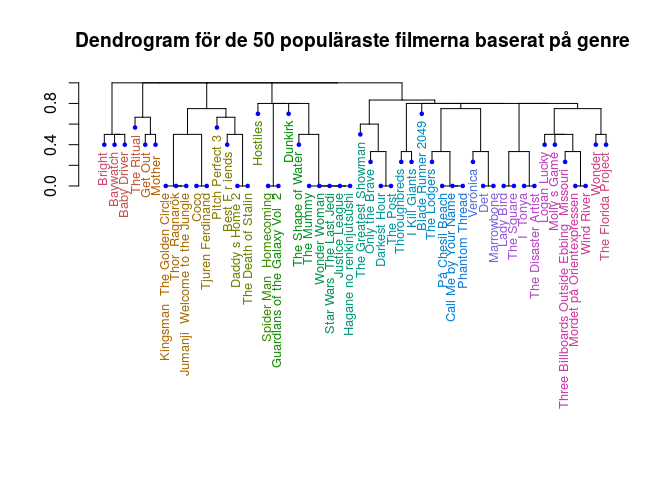

Skrapa och analysera data från Imdb
================
Jan Alexandersson
February 10, 2018

Introduktion
============

De flesta av oss känner nog igen sig i att efter en lång vecka slå sig ner framför <tv:n> på fredagkvällen med chipsen redo och mysbrallorna på. Middagen är nere i magen och disken är diskad och nu finns det bara ett problem. Vilken film ska man välja?

Detta dilemma är ofta helt avgörande för hur kvällen kommer bli. Ett vanligt utfall är att det blir vilda diskussioner om vilken film det ska bli och tillslut är alla på så dåligt humör att ingen längre vill se på film. Ett annat utfall kan vara att man tar till internet och söker efter vilka filmer som är populära. Det senare blev i alla fall utfallet för mig, vilket förde mig till [Imdb:s lista över de mest populära filmerna utgivna 2017](http://www.imdb.com/search/title?year=2017&title_type=feature&) (Imbd, The Internet Movie Database 2018). Den fick mig att fundera på om populära filmer nödvändigdvis får bättre betyg. En film med dåligt betyg kan fortfarande vara en film anses vara populär. Jag bestämde mig då för att vidare undersöka informationen som finns i listan. Syftet med analysen är att undersöka ett flertal naturliga frågeställningar och försöka svara på dessa med illustrationer. Frågorna är främst relaterade kring Imdb-betyg och genre hos filmerna.

Data
====

Det finns flera sätt för att få över informationen till R. Man skulle kunna kopiera allt för hand, vilket är väldigt tidskrävande och det är lätt hänt att man gör fel. Ett annat sätt är att använda hemsidans API om de finns tillgängligt. Sättet jag har valt att göra på är att skrapa datan med hjälp av paketet `rvest` och CSS SelectorGadget (Andrew Cantino and Kyle Maxwell 2018), en extension i Google Chrome.

De variablerna jag har skrapat är:

-   Titel
-   Popularitetsrank i listan
-   Genre
-   Imdb-betyg
-   Inkomst
-   Speltid
-   Regissör
-   Metascore (CBS Interactive Inc. 2018) (ett viktat medelvärde av betyg från filmkritiker)
-   Skådespelare (De fyra som visas visas i listan)
-   URL till filmens Imdb-sida

Vi måste förtydliga vad popularitetsrank, Imdb-betyg och metascore är. Vad Imdb baserar sin popularitetsrank på är oklart, kan möjligen vara ett aggregat av sidvisningar, biobesök, antal användare som givit filmen betyg och liknande. Det finns alltså ingen lättilgänglig förklaring vad Imdb baserat detta mått på. Imdb-betyget kommer från användare från Imdb som sett filmen och valt att ge den ett betyg från 1-10 och medelvärdet av dessa ger Imdb-betyget. Metascore är ett betyg som liknar Imdb-betyget men där kan inte vem som helst ge ett betyg, det kommer från riktiga filmkritiker varar minst 4st har givit ett betyg. (CBS Interactive Inc. 2018)

Källkod för insamling av data
-----------------------------

Funktionen nedan tar Imdbs-listans url och returnerar en lista med listor som innehåller de olika variabelvärdena. Raden `title <- html_text(html_nodes(webpage, '.lister-item-header a'))` ger till exempel en lista med alla titlar. `'.lister-item-header a'` får jag genom att använda SelectorGadget på titlarna i webbsidan.

``` r
#den här funktionen sköter inläsningen av websidan
readPageImdb <- function(url){
  
  #här sparar jag sidan lokalt så att den inte laddas ner mer än en gång
  #då jag läser in variabel för variabel nedan istället för allt samtidigt
  webpage <- read_html(url)
  #nedan använder jag en extention i webbläsaren, CSS selector för att hitta nodes
  
  #popularity_rank
  popularity_rank <- html_text(html_nodes(webpage, '.text-primary'))
  
  #title
  title <- html_text(html_nodes(webpage, '.lister-item-header a'))
  
  #imdb_score  
  #här tar jag med både rank och imdb_score
  #rank slutar alltid med en punkt och imdb_score slutar alltid med siffra
  #jag byter ut alla element i listan som slutar på punkt mot "x"
  #detta gör jag för att jag ska kunna hitta saknade värden
  #dvs har jag nu två "x" i rad så saknas det ett imdb_score emellan
  #detta tas hand om senare
  imdb_score <- html_text(html_nodes(webpage, '.ratings-imdb-rating strong , .text-primary'))
  imdb_score <- gsub(".*\\.$", "x", imdb_score)
  
  #genre         
  genre <-  html_text(html_nodes(webpage, '.text-primary , .genre'))
  genre <- gsub(".*\\.$", "x", genre)
  
  #gross       
  #samma princip här för saknade värden som i imdb_score
  gross <-  html_text(html_nodes(webpage, ".ghost~ .text-muted+ span , .text-primary"))
  gross <- gsub(".*\\.$","x", gross)
  
  #runtime
  #lägger till "x" för att hantera saknade värden på hemsidan
  runtime <- html_text(html_nodes(webpage, '.text-primary , .text-muted .runtime'))
  runtime <- gsub(".*\\.","x", runtime)
  
  
  #metascore
  #lägger till "x" för att hantera saknade värden på hemsidan
  metascore <- html_text(html_nodes(webpage, '.unfavorable , .mixed , .favorable , .text-primary'))
  metascore <- gsub(".*\\.","x", metascore)
  
  
  #director
  director <-html_text( html_nodes(webpage, '.text-muted+ p a:nth-child(1)'))
  
  #url till filmens imdb-sida
  #används inte någonstans , men kan användas för att hämta ytterligare information
  #Gjorde ett försök att hämta budget från varje film men det tog mycket lång tid
  #att läsa in 500 olika sidor och budget var i olika valutor för olika filmer
  movie_url <- html_attr(html_nodes(webpage, ".lister-item-header a"), "href")
  movie_url <- paste0("http://www.imdb.com", movie_url)
  
  #actors
  #får ut stränar med 4 skådespelare som jag sedan rensar så att endast namnen är kommaseparerade
  #splitar sedan alla strängar vid komma
  actor <- html_text(html_nodes(webpage, '.text-muted~ .text-muted+ p , .ratings-bar~ .text-muted+ p'))
  actor <- gsub(".*Stars:", "", actor)
  actor <- gsub("\n", "", actor)
  actor <- gsub("  ", "", actor)
  actor <- strsplit(actor, ", ")
  
  #denna funktion tar sedan ut den nte skådespelaren ur varje film
  #det vill säga att den plockar ut skådespelare i ordningen som de listas i på websidan
  nthActor <- function(actor, number){
    actorList <- c()
    for(i in 1:length(actor)){
      actorList <-append(actorList, actor[[i]][number])
    }
    return(actorList)
  } 
  #använder funktionen och får ut alla skådespelare 
  #actor1 innehåller alltså den första skådespelaren för varje film, osv
  actor1 <- nthActor(actor, 1)
  actor2 <- nthActor(actor, 2)
  actor3 <- nthActor(actor, 3)
  actor4 <- nthActor(actor, 4)
  
  #här kommer funktionen som utnyttjar att "x" är inlagt i några listor
  #den kollar helt enkelt om det finns två stycken "x" i rad och lägger in ett NA emellan dem
  #sedan tas alla "x" bort
  missingValues <- function(attribute){
    missingValuesInAttribute <- c()
    for(i in 1:(length(attribute) - 1)){
      if( (attribute[i] == "x") & (attribute[i+1] == "x") ){
        missingValuesInAttribute <- append(i+1, missingValuesInAttribute)
      }
    }

    for (i in missingValuesInAttribute){

      a<-attribute[1:(i-1)]

      b<-attribute[i:length(attribute)]

      attribute <-append(a, list("NA"))

      attribute<-append(attribute, b)

    }
    #specialfall som inte hanteras av ovanstående kod
    #om det är ett saknat värde i slutet så behöver det inte vara två "x" i rad
    #om sista värdet är "x" läggs NA till efter
    if(attribute[length(attribute)] == "x"){
      attribute <-append(attribute, "NA")
    }

    attribute <- unlist(attribute[!(attribute %in% "x")])
    return(attribute)
  }
  
  #lägger in saknade värden
  imdb_score <- missingValues(imdb_score)
  gross <- missingValues(gross)
  metascore <- missingValues(metascore)
  runtime <- missingValues(runtime)
  genre <- missingValues(genre)

  v <- list(title, popularity_rank, genre, imdb_score, gross, runtime, director,
            metascore, actor1, actor2, actor3, actor4, movie_url)
  
  return(v)
}
```

En svårighet är att information saknas för vissa filmer, till exempel så har vissa filmer ingen inkomst dokumenterad. Min kod genererar då en lista som inte har samma längd som till exempel listan med titlar, vilket leder till att vi inte kan para ihop titel med inkomst. Detta löses genom att också ta med popularitetsranken i listan när vi läser in inkomst så vi får tillbaka vartannat element rank och vartannat element inkomst, med undantag då inkomst saknas. Vid de ställen som har två rank-element i rad så lägger vi till `NA` mellan dem och sedan tar vi bort alla ranker så att endast inkomst är kvar. Funktionen `missingValues` i kodstycket ovanför sköter detta.

Vi vill nu läsa in flera sidor från Imdb-listan, då webbsidan endast innehåller 50st per sida, och sedan sammaställa allt i en dataframe (tabell). Nedan läser vi in de 500 populäraste filmerna från 2017. Vi rensar också bort överflödiga symboler och tecken i datan här.

``` r
#den här funktionen sätter ihop en dataframe från inläsning av flera sidor i imdb-listan
getPagesMakeDf <- function(webpage_url, pages){
  #assignar tomma vektorer som sedan ska fyllas i med info från de websidan
  title <- c()
  popularity_rank <- c()
  genre <- c()
  imdb_score <- c()
  gross <- c()
  runtime <- c()
  director <- c()
  metascore <- c()
  actor1 <- c()
  actor2 <- c()
  actor3 <- c()
  actor4 <- c()
  movie_url <- c()
  #########################
  
  #listan på imdb består av flera sidor, så här loopas inläsning av ett valt antal sidor i listan
  #varje sida innehåller 50st filmer
  for(i in 1:pages){
    url <- paste0(webpage_url, "page=" , i)
    #temporär lista som ska läggas på på de olika variablerna vi assignade tidigare
    temp <- readPageImdb(url)
    
    title <- c(title, temp[[1]])
    popularity_rank <- c(popularity_rank, temp[[2]])
    genre <- c(genre, temp[[3]])
    imdb_score <- c(imdb_score, temp[[4]])
    gross <- c(gross, temp[[5]])
    runtime <- c(runtime, temp[[6]] )
    director <- c(director, temp[[7]] )
    metascore <- c(metascore, temp[[8]] )
    actor1 <- c(actor1, temp[[9]] )
    actor2 <- c(actor2, temp[[10]])
    actor3 <- c(actor3, temp[[11]])
    actor4 <- c(actor4, temp[[12]])
    movie_url <- c(movie_url, temp[[13]])
  }
  
  ##########################################################
  
  #sätter ihop allt och skapar en dataframe
  imdb_df <- data.frame(title, popularity_rank, genre, imdb_score, gross, runtime, director, metascore,
                actor1, actor2, actor3, actor4, movie_url, stringsAsFactors=FALSE) 
  
  #rensar dataframen från oönskat "skräp" så som tecken och liknande så att 
  #värden kan göras om till numeriska
  #Det fanns två filmer med samma namn, nr 1 och 2 av en film, fast det stod inte i titeln
  #unique= TRUE löser detta så att alla radnamn blir unika
  imdb_df <- imdb_df %>%
    mutate(title = gsub("\\.", " ", make.names(title, unique = TRUE))) %>% 
    mutate(popularity_rank = gsub("\\." , "" , popularity_rank)) %>%
    mutate(popularity_rank = as.numeric(popularity_rank)) %>%
    mutate(genre = gsub("\n" , "", genre)) %>%
    mutate(genre = gsub(" " , "", genre)) %>%
    mutate(imdb_score = as.numeric(imdb_score)) %>%
    mutate(gross = gsub("\\$|M", "", gross)) %>%
    mutate(gross = as.numeric(gross)) %>%
    mutate(runtime = gsub(" min", "" , runtime)) %>%
    mutate(runtime = as.numeric(runtime)) %>%
    mutate(metascore = gsub(" ", "", metascore)) %>%
    mutate(metascore = as.numeric(metascore))
  
  return(imdb_df)
}
#"http://www.imdb.com/search/title?year=2017&title_type=feature&"
#nu finns dataframen tillgänglig globalt i workspace
imdb_df <- getPagesMakeDf("http://www.imdb.com/search/title?year=2017&title_type=feature&", 10)
```

Vi kan nu undersöka en del av datan för att få en överblick.

``` r
glimpse(imdb_df)
```

    ## Observations: 500
    ## Variables: 13
    ## $ title           <chr> "The Shape of Water", "Three Billboards Outsid...
    ## $ popularity_rank <dbl> 1, 2, 3, 4, 5, 6, 7, 8, 9, 10, 11, 12, 13, 14,...
    ## $ genre           <chr> "Adventure,Drama,Fantasy", "Crime,Drama", "Act...
    ## $ imdb_score      <dbl> 7.6, 8.3, 8.0, 7.6, 8.1, 7.6, 7.9, 8.5, 6.8, 7...
    ## $ gross           <dbl> 58.59, 52.64, 314.99, 48.53, 17.16, 29.25, 165...
    ## $ runtime         <dbl> 123, 115, 130, 94, 132, 120, 105, 105, 120, 10...
    ## $ director        <chr> "Guillermo del Toro", "Martin McDonagh", "Taik...
    ## $ metascore       <dbl> 87, 88, 74, 94, 93, 77, 48, 81, 45, 84, 52, 75...
    ## $ actor1          <chr> "Sally Hawkins", "Frances McDormand", "Chris H...
    ## $ actor2          <chr> "Octavia Spencer", "Woody Harrelson", "Tom Hid...
    ## $ actor3          <chr> "Michael Shannon", "Sam Rockwell", "Cate Blanc...
    ## $ actor4          <chr> "Doug Jones", "Caleb Landry Jones", "Mark Ruff...
    ## $ movie_url       <chr> "http://www.imdb.com/title/tt5580390/?ref_=adv...

Analys av popularitet och betyg
===============================

Vi vill nu försöka besvara den ursprungliga frågan, huruvida popularitet är positivt korrelerat med högt betyg, med ett enkelt spridningsdiagram.

``` r
theme_egen <- theme(
  panel.background = element_rect(fill = "azure",
                                colour = "azure1",
                                size = 0.5, linetype = "solid"),
  panel.grid.major = element_line(size = 0.5, linetype = 'solid',
                                colour = "gray87"), 
  panel.grid.minor = element_line(size = 0.25, linetype = 'solid',
                                colour = "gray87")
  )
```

``` r
#välj ut den film med högst imdb_score
highestImdbScore <- imdb_df %>% 
  slice(which.max(imdb_score))

#väljer filmer med lågt imdb_score men hög popularitet
lowImdbHighPop <- imdb_df %>% 
  filter(imdb_score <= 4.0) %>% 
  filter(popularity_rank <= 100) 

#använder de filmer vi valde ut ovan för att visa deras titel i ploten, för de är mest intressanta
imdb_df %>% 
  ggplot(aes(x = popularity_rank , y = imdb_score)) +
  geom_point() +
  geom_smooth(method = "lm", se = FALSE) +
  scale_x_reverse() + 
  xlab("Rank i popularitet") +
  ylab("Imdb-betyg") +
  geom_text(data = rbind(highestImdbScore ,lowImdbHighPop), 
            aes(x = popularity_rank, y = imdb_score, label = title),
            size = 2.4, vjust = -0.5) +
  ggtitle("Figur 1:Filmernas Imdb-betyg och deras rank i popularitet") +
  theme_egen
```


Vi observerar i Figur 1 att en populärare film inte nödvändigtvis har högre betyg än en med lägre popularitet men att de håller en högre standard gällande betyget. Det är mycket färre filmer under 5 poäng i topp 100 än för de efter topp 100. Vi får därför en svagt uppåtgående trend i poäng vid högre popularitet.

En annan naturlig fråga är om betyget påverkas av filmernas längd, eller om det finns en optimal längd hos filmer som föredras och ger högre betyg. Vi ser nedan i Figur 2 att betyget verkar öka med speltiden hos filmen. Detta kan såklart ha många olika förklaringar och det kan finnas flera underliggande variabler.

``` r
imdb_df %>% 
  ggplot(aes(x = runtime , y = imdb_score)) +
  geom_point() +
  geom_smooth(method = "lm", se = FALSE)  + 
  xlab("Speltid (minuter)") +
  ylab("Imdb-betyg") +
  ggtitle("Figur 2: Filmernas Imdb-betyg och deras längd") +
  theme_egen
```


Vidare kan man också fundera på om de olika betygssättningarna är speciellt olika och varför det är intressant att ha två olika betyg. Bedömer filmkritiker filmer annorlunda än den vanlliga filmtittaren? Jag tror många av oss känner igen oss i situationen då vi sett en film och tyckt att den var riktigt bra, för att sedan se den bli hårt kritiserad av någon filmkritiker som tycker helt motsatt. Är det verkligen så att filmkritikerna bedömmer annorlunda?

``` r
#film som de olika betygstyperna är oense om
#ringar in ett områdde där och plotar text för ett oense område
biggestDiffScore <-imdb_df  %>% 
  filter(metascore < 50)  %>% 
  filter(imdb_score > 7) 
imdb_df %>% 
  filter(!is.na(metascore) ) %>% 
  ggplot(aes(x = imdb_score , y = metascore)) +
  geom_point() +
  #geom_smooth(method="lm", se = FALSE) +
  geom_abline(intercept = 0, slope = 10, color = "blue3")+
  geom_text(data = biggestDiffScore, 
            aes(x = imdb_score, y = metascore,label = title), 
            size = 2.4, vjust= -1) +
  geom_encircle(data = biggestDiffScore,
                aes(x = imdb_score, y = metascore), 
                color = "red", 
                size = 1, 
                expand = 0.05) +
  xlab("Imdb-betyg") +
  ylab("Metascore") +
  ggtitle("Figur 3: Filmernas Imdb-betyg och deras metascore") +
  theme_egen
```


Svaret är att vi i stort sett bedömmer likadant med undantag för några outliers som till exempel The Greatest Showman, vilket vi ser i Figur 3. Man kan dock antyda att filmkritikerna ger ofta ett lite lägre betyg då vi observerar ett högre antal filmer under linjen än ovanför. Linjen har ritats med en en lutning på 10 eftersom metascore använder en skala från 1 till 100 och Imdb-betyg använder en skala 1 till 10. Linjen förväntas därför motsvara ett läge då filmerna bedöms lika i de båda betygssättningarna.

Analys av genre
===============

En film i listan kategoriseras av en till tre genrer som i vår dataframe sparats som en kommaseparerad sträng i genre-kolumnen, vilket visas i tabellen nedan.

``` r
imdb_df %>%  
  select(title, genre) %>% 
  slice(1:10) %>% 
  kable()
```

| title                                    | genre                      |
|:-----------------------------------------|:---------------------------|
| The Shape of Water                       | Adventure,Drama,Fantasy    |
| Three Billboards Outside Ebbing Missouri | Crime,Drama                |
| Thor Ragnarök                            | Action,Adventure,Comedy    |
| Lady Bird                                | Comedy,Drama               |
| Call Me by Your Name                     | Drama,Romance              |
| I Tonya                                  | Biography,Comedy,Drama     |
| The Greatest Showman                     | Biography,Drama,Musical    |
| Coco                                     | Animation,Adventure,Comedy |
| Justice League                           | Action,Adventure,Fantasy   |
| Get Out                                  | Horror,Mystery,Thriller    |

Om vill vi göra mer med genrerna än att bara veta vilka genrer en film har så bör vi spara om det i ett annat format. Vi gör om genre-kolumnen till ett brett format med en kolumn för varje genre, som endast innehåller ettor och nollor. En etta indikerar att filmen tillhör den genren.

Funktionen nedan tar genre-kolumnen i vår dataframe och returnerar en ny dataframe av en så kallad gles matris som utgörs till största del av nollor.

``` r
#Kan göras enklare med spread() om filmerna endast haft en genre.
genre_func <- function(dataframe){
  #för tar vi reda på vilka genrer som finns representerade i datasetet, dvs alla unika genrer
  genres <- dataframe$genre %>% strsplit(",") %>% unlist() %>% unique()
  
  genre_df <- data.frame(select(dataframe, genre) )
  #skapar nollfyllda kolumner med de olika genrerna som variabelnamn
  for(i in genres){
    genre_df[ ,i] <- rep(0, nrow(genre_df))
  }
  
  #för varje film och genre så byts 0 mot 1 där en "matchning" i genre-kolumnen i den 
  #usprungliga dataframen
  for(j in 1:nrow(genre_df)){
    
    for(i in genres){
      
      #grepl är liknande str_detect
      if(grepl(i , genre_df$genre[j])){
        genre_df[j,i]<- 1
      }
    }
  }
  #Sci-Fi skapade problem med bindestreck så detta tas bort
  genre_df <- genre_df%>% select(-genre)
  names(genre_df) <- gsub("-", "", names(genre_df) )
  #lägger till radnamn så man vet vilken film genrerna korresponderar till
  rownames(genre_df) <- dataframe$title
  
  return(genre_df)
}
#en dataframe med titel som radnamn och som innehåller 
#den glesa matrisen med de olika genrerna som kolumnnamn
genre_df <- genre_func(imdb_df)
```

En kombinerad dataframe med all tidigare information tillsammans med det nya formatet på genre förenklar analysen.

``` r
#lägger ihop så vi har all info i en dataframe
#spelar ingen roll vilken join som används här, har alltid samma antal rader med samma titlar
imdb_df_genres_spread <- inner_join(imdb_df, rownames_to_column(genre_df), 
                                    by = c("title"="rowname")) %>% 
  select(-genre)
#nu finns en dataframe med all den gamla infon och den glesa matrisen med 
#nollor och ettor tillsammans som en dataframe tillgänglig
```

Vi kan börja med att undersöka vilka genrer som är mest representerade bland de 500 populäraste filmerna. Som jämförelse så är också de 500 populäraste filmerna från 2015 respektive 2016 med och vi finner att fördelningarna för åren är slående lika.

``` r
getGenreCount <- function(dataframe, year){
  dataframe <-  dataframe %>% 
    colSums() %>% 
    as.data.frame()  %>% 
    rownames_to_column("genre") %>% 
    mutate(year = year) %>% 
    `colnames<-`(c("genre", "freq", "year")) %>% 
    mutate(freq = freq/nrow(dataframe))
  
  return(dataframe)
}

imdb_df_2017 <- getGenreCount(genre_df, 2017)

imdb_df_2016 <- genre_func(getPagesMakeDf("http://www.imdb.com/search/title?year=2016&title_type=feature&", 10))  
imdb_df_2016 <- getGenreCount(imdb_df_2016, 2016)

imdb_df_2015 <- genre_func(getPagesMakeDf("http://www.imdb.com/search/title?year=2015&title_type=feature&", 10))  
imdb_df_2015 <- getGenreCount(imdb_df_2015, 2015)

genre_df_by_year <- rbind.fill(imdb_df_2017, imdb_df_2016, imdb_df_2015)

genre_df_by_year %>% 
  arrange(-freq) %>% 
  ggplot(aes(x = reorder(factor(genre), -freq), y = freq, fill = factor(year))) +
  geom_bar(stat = "identity", position = "dodge") +
  theme(axis.text.x = element_text(angle = 45, hjust = 1), 
        panel.grid.major = element_blank(), panel.grid.minor = element_blank()) +
  scale_fill_manual(values = c("rosybrown", "maroon3", "black"), 
                    guide = guide_legend(title = "År")) +
  xlab("Genre") +
  ylab("Andel förekomster bland filmerna") +
  ggtitle("Figur 4: Genrernas fördelning hos de 500 populäraste filmerna åren 2015-2017")
```


Vi ser i Figur 4 att drama är den överlägset mest representerade genren. Man ska dock vara försiktig och säga att det är den mest populära genren, det skulle också kunna vara så att drama är den bredaste genren och kan representeras av flest filmer oberoende av hur populära de är. Man kan till exempel tänka sig att drama kan kombineras med många olika genrer, men till exempel sci-fi och sport sällan överlappar.

Något man kan tänka sig är att om en film är mer populär så bör den också ha högre intäkter, vilket till inte så stor förvåning är sant. Det intressanta dyker upp om man tittar på vilka filmernas inkomst beroende på genre.

``` r
#färglägger alla filmer som är av genren Drama
grossplot1 <- imdb_df_genres_spread %>% 
  ggplot(aes(x = popularity_rank , y = gross, color = as.factor(Drama))) +
  geom_point(alpha = 0.7) +
  labs(title="Ifylld efter Drama") +
  scale_color_manual(values=c("0"="grey", "1"="black"), 
            guide = guide_legend(title = NULL), 
            labels = c("Ej drama", "Drama")) +
  scale_x_reverse() +
  scale_y_log10(labels = scales::format_format(big.mark = " ", 
                                               scientific = FALSE)) + 
  theme(legend.position = "bottom") +
  xlab("Rank i popularitet") +
  ylab("Intäkter (miljoner dollar)")
  

#väljer den film som dragit in mest pengar och lägger till titel i ploten
highestGrossMovie <- imdb_df_genres_spread %>% 
  slice(which.max(gross))
#färglägger alla filmer som är av genren Action
grossplot2 <- imdb_df_genres_spread %>% 
  ggplot(aes(x = popularity_rank , y = gross, color = as.factor(Action))) +
  geom_point(alpha = 0.7) +
  labs(title = "Ifylld efter Action") +
  scale_color_manual(values = c("0" = "grey", "1" = "black"), 
            guide = guide_legend(title = NULL), 
            labels = c("Ej action", "Action")) +
  geom_text(data = highestGrossMovie, aes(x = popularity_rank, y = gross, 
            label = title), size = 2.4, 
            vjust = -0.5, hjust = "inward") +
  scale_x_reverse() +
  scale_y_log10(labels = scales::format_format(big.mark = " ", 
                                               scientific = FALSE)) + 
  theme(legend.position="bottom") +
  xlab("Rank i popularitet") +
  ylab("Intäkter (miljoner dollar)")
      
#Sätter plottarna bredvid varandra
grid.arrange(grossplot1, grossplot2, ncol = 2, top = "Figur 5: Filmernas intäckter och popularitet")
```


Notera att vi använder logaritmisk skala på inkomsten. Detta val kan motiveras av lagen om sjunkande avkastning (Wikipedia, the free encyclopedia 2018). Figur 5 tycks antyda ett ungefärligt linjärt samband mellan intäkter och popularitet.

Vi ser i Figur 5 att actionfilmer verkar ha mycket högre inkomster än filmer med drama som genre. En hypotes om varför så är fallet är att en actionfilm ses allra bäst på bio där de häftiga filmeffekterna upplevs maximalt, men att en dramafilm ser man kanske hellre hemma i soffan och av den anledningen så har actionfilmer generellt en högre inkomst. Man kan egentligen inte dra några slutsatser då det även här kan finnas många dolda variabler.

Det är också naturligt att fråga sig om filmlängden tenderar att vara olika beroende på genre. Vi illustrerar nedan detta för några genrer.

``` r
#RUNTIME
#densityplot över filmernas längd beroende på genre
runtimeplot1 <- imdb_df_genres_spread %>% 
  ggplot(aes(x = runtime)) +
  geom_density(aes(fill = Animation == 1), alpha = 0.8) + 
  scale_fill_manual(values = c("rosybrown", "maroon3"), 
                    guide = guide_legend(title = NULL), 
                    labels = c("Ej animerad", "Animerad")) +
  xlab("Speltid (minuter)")
  
runtimeplot2 <-imdb_df_genres_spread %>% 
  ggplot(aes(x = runtime)) +
  geom_density(aes(fill = Thriller == 1), alpha = 0.8) +
  scale_fill_manual(values = c("rosybrown", "maroon3"), 
                    guide = guide_legend(title = NULL), 
                    labels = c("Ej thriller", "Thriller")) +
  xlab("Speltid (minuter)")

runtimeplot3 <-imdb_df_genres_spread %>% 
  ggplot(aes(x = runtime)) +
  geom_density(aes(fill = Fantasy == 1), alpha = 0.8) +
  scale_fill_manual(values = c("rosybrown", "maroon3"), 
                    guide = guide_legend(title = NULL), 
                    labels = c("Ej fantasy", "Fantasy")) +
  xlab("Speltid (minuter)")

runtimeplot4 <-imdb_df_genres_spread %>% 
  ggplot(aes(x = runtime)) +
  geom_density(aes(fill = Drama == 1), alpha = 0.8) +
  scale_fill_manual(values = c("rosybrown", "maroon3"), 
                    guide = guide_legend(title = NULL), 
                    labels = c("Ej drama", "Drama")) +
  xlab("Speltid (minuter)")

grid.arrange(runtimeplot1, runtimeplot2, runtimeplot3,runtimeplot4, 
             ncol = 2, nrow = 2, 
             top = "Figur 6: Filmlängdernas fördelning beroende på genre")
```


Vi observerar i Figur 6 att animerade filmer har en längd på runt en och en halv timme med mycket liten spridning, men att en fantasyfilm har generellt sett betydligt längre speltid men också större spridning.

Man kan också vara intresserad av korrelation mellan olika typer av genrer. Vilka genrer överlappar ofta och vilka genrer är väldigt skilda ifrån varandra. Ett utmärkt vertyg för detta är ett korrelogram.

``` r
#CORRELOGRAM
#korellogram av genre
corr <- cor(genre_df)
ggcorrplot(corr, hc.order = TRUE, 
           type = "lower", 
           lab = TRUE, 
           lab_size = 2, 
           method = "circle", 
           colors = c("darkorchid4", "white", "chartreuse3"), 
           title = "Korrelogram mellan genrer", 
           ggtheme = theme_bw)
```


Vi avläser i korrelogrammet att animerade filmer och äventyr har en hög korrelation och att historiska filmer och biografier också har det. Negativ korrelation finner vi mellan komedi och thriller, bland annat, vilket inte är speciellt överraskande.

Om vi vill jämföra filmer beroende på deras genre gör vi detta lätt med en värmekarta. Vi jämför nu de 50 populäraste filmerna från 2017. Filmerna är ordnade så att liknande filmer ligger bredvid varandra så att det blir enklare att jämföra dem emellan.

``` r
#tar de 50 mest populära filmerna
#lägger till radnamn som av någon anledning försvinner vid slice, filter, mutet, etc..
genre_df_50 <- genre_df %>% 
  slice(1:50) %>% 
  as.data.frame()
rownames(genre_df_50) = rownames(genre_df)[1:50]

#######################

#HEATMAP
cluster_obs <- cutree(hclust(dist(genre_df_50)), k=6)
genre_df_50 %>% 
    rownames_to_column("title") %>%
    mutate(title = reorder(title, cluster_obs), cluster = cluster_obs) %>% 
    gather(key = key, value = value, colnames(genre_df_50) ) %>%
    mutate(value = as.factor(value)) %>% 
    ggplot(aes(x = key, y = title)) + 
    geom_tile(aes(fill = value), color = "grey") + 
    theme_grey(base_size = 8) +
    scale_fill_manual(values = c("0" = "white", "1" = "darkolivegreen2"),
                      guide = FALSE) +
    xlab("") + 
    ggtitle("Värmekarta för de 50 mest populära filmerna baserat på genre") + 
    theme(axis.text.x = element_text(angle = 45, hjust = 1)) 
```


Vi kan här till exempel se att om man tycker om filmen Spider Man Homecoming så bör man troligtvis också tycka om Guardians of the Galaxy Vol 2 också, baserad på deras genre, då de båda filmerna kategoriseras av genrerna action, äventyr och sci-fi.

Om vi bara är intresserade av vilka filmer som liknar varandra men inte är intresserade av att veta vilka specifika genrer de har så är ett dendrogram, arrangerat av klusteranalys, att föredra. Det blir nu mycket enkelt att jämföra vilka fimer som är lika. Nackdelen är att vi här tappar information jämfört med värmekartan, men fördelen är att det blir mer lättläst.

``` r
#DENDROGRAM
d = dist(genre_df_50 , method = "binary")
hc = hclust(d)
#plot(hc,cex = 0.6)

#klustrat dendrogram
#filmer i ett kluster är alltså lika varandra i genre
#gillar man en film i klustret så är chansen stor att man gillar de andra, baserat på genre
dend <- as.dendrogram(hc, hang = 0.1) %>% 
  color_labels() %>%
  set("leaves_pch", 19) %>% 
  set("leaves_cex", 0.5) %>% 
  set("leaves_col", "blue") %>% 
  set("labels_cex", 0.80)  
    

op <-par(mar = c(15, 4, 4, 2)+ 0.1)
plot(dend, cex = 0.6, main="Dendrogram för de 50 populäraste filmerna baserat på genre ")
```



``` r
par(op)
```

Vi kan se det som en simpel film-rekomenderare genom att om man tycker om en film i denrogrammet är chansen stor att man gillar filmerna inom samma kluster. Detta är en funktion som faktiskt finns på Imdb, dock betydligt mer avancerad än den vi visat upp.

Källhänvisning
==============

Andrew Cantino and Kyle Maxwell. 2018. “SelectorGadget: Point and Click Css Selectors.” <http://selectorgadget.com/>.

CBS Interactive Inc. 2018. “Metacritic.” <http://www.metacritic.com/>.

Imbd, The Internet Movie Database. 2018. “Imdb.” <http://www.imdb.com/search/title?year=2017&title_type=feature&>.

Wikipedia, the free encyclopedia. 2018. “Diminishing Returns.” <https://en.wikipedia.org/wiki/Diminishing_returns>.
